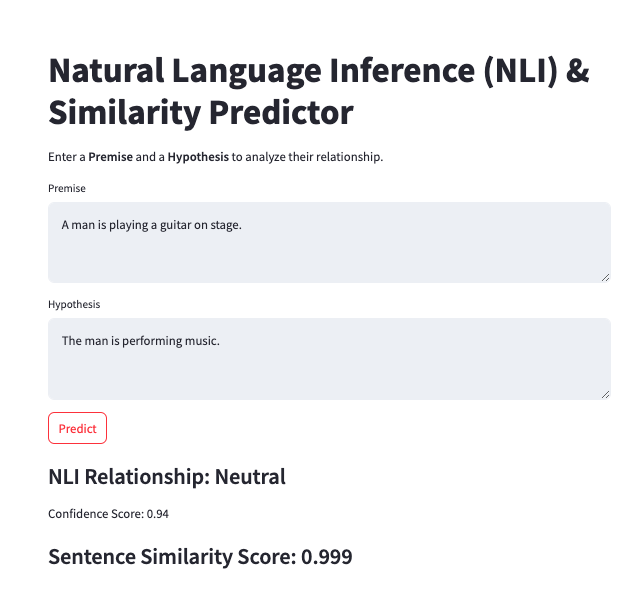

# Natural Language Inference (NLI) & Sentence Similarity Predictor

## Table of Contents
- [Project Overview](#project-overview)
- [Student Information](#student-information)
- [Features](#features)
- [Web Application Documentation](#web-application-documentation)
- [Model Details & Training Process](#model-details--training-process)
- [Performance Metrics](#performance-metrics)
- [Challenges & Future Improvements](#challenges--future-improvements)
- [Project Directory Structure](#project-directory-structure)

---
...

## **Project Overview**
This project implements a **Natural Language Inference (NLI) & Sentence Similarity Predictor** using a custom-trained **BERT model**. The application allows users to input a **Premise** and a **Hypothesis**, and it predicts the **relationship** between them (**Entailment, Neutral, or Contradiction**) while also computing the **cosine similarity score**.

The **web app is implemented using Streamlit** and runs locally.

---

## **Student Information**
- **Name**: Soe Htet Naing  
- **Student ID**: st125166  

---

## **Features**
✅ **Natural Language Inference (NLI)** - Classifies relationships as **Entailment, Neutral, or Contradiction**  
✅ **Sentence Similarity** - Computes a **cosine similarity score** between two sentences  
✅ **Fine-tuned BERT Model** - Uses a custom BERT model trained on SNLI and MNLI datasets  
✅ **Streamlit Web App** - Interactive UI for easy experimentation  
✅ **Optimized for Local Execution** - No deployment required  

---

## **Web Application Documentation**

### **How to Run**
1. Ensure all dependencies are installed.
2. Navigate to the `app` folder.
3. Run `streamlit run app.py`.
4. Open `http://localhost:8501/` in your browser.

Screenshots of testing web are shown in `samples_images`.



### **Usage**
- Enter a Premise and a Hypothesis in the input boxes.
- Click "Predict" to see the model's output.
- The app will display:
  - **NLI Prediction** (Entailment, Neutral, or Contradiction)
  - **Confidence Score**
  - **Cosine Similarity Score**

### **Documentation**
1. **Model Loading**:
   - The trained model (`s_model.pt`) and metadata (`param.pkl`) are loaded at runtime.
2. **Inference Tasks**:
   - `calculate_similarity()` computes cosine similarity between two sentences.
   - `predict_nli()` classifies sentence relationships.
3. **Streamlit Integration**:
   - User input is taken via Streamlit widgets.
   - Predictions are displayed dynamically based on model inference.

---

## **Model Details & Training Process**

### **Pretraining Details (BERT_from_Scratch.ipynb)**
- **Dataset**: BookCorpus (100,000 samples)
- **Batch Size**: 6
- **Max Masked Tokens**: 5
- **Max Sequence Length**: 1000
- **Epochs**: 50
- **Optimizer**: Adam (`lr=0.001`)
- **Loss Function**: CrossEntropyLoss

#### **Pretraining Loss Progression:**
```
Epoch: 00 | Loss = 106.424217
Epoch: 10 | Loss = 67.433327
Epoch: 20 | Loss = 33.929317
Epoch: 30 | Loss = 17.502008
Epoch: 40 | Loss = 10.791962
```

---

### **Fine-Tuning Details (S_BERT.ipynb & S_BERT_pretrain.ipynb)**
- **Dataset**: SNLI & MNLI datasets (10,000 training samples, 1,000 validation, 100 test)
- **Batch Size**: 2 (S_BERT) / 32 (S_BERT_Pretrain)
- **Epochs**: 5 (Pretrain), 1 (Fine-Tuning)
- **Tokenizer**: BERT-base-uncased

#### **Fine-Tuning Loss Progression:**
```
Epoch: 1 | Loss = 1.218582
Epoch: 2 | Loss = 1.150355
Epoch: 3 | Loss = 1.120121
Epoch: 4 | Loss = 1.020953
Epoch: 5 | Loss = 1.065891
```

---

## **Performance Metrics**
| Model | Dataset | Cosine Similarity | NLI Accuracy |
|--------|---------|------------------|-------------|
| S-BERT Fine-Tuned | SNLI | **0.9991** | **High** |
| Pretrained S-BERT | MNLI | **0.8057** | **Moderate** |

---

## **Challenges & Future Improvements**
### **Challenges Faced**
- Handling **large tensor operations** efficiently in PyTorch.
- **Ensuring model compatibility** with saved state dictionaries.
- Training on **limited computational resources**.

### **Future Enhancements**
- **Expand dataset size** to improve generalization.
- **Optimize inference speed** using distillation techniques.
- **Deploy the model online** using a cloud-based server.

---

## **Project Directory Structure**
```
NLPA4/
├── app/
│   ├── models/                 
│   │   ├── param.pkl           # Tokenizer parameters
│   │   ├── s_model.pt          # Trained BERT model
│   ├── app.py                  # Streamlit application
│   ├── utils.py                # Model utilities & functions
├── BERT.ipynb                  # Pretraining BERT Model
├── S_BERT_pretrain.ipynb       # Pretraining BERT for NLI
├── S_BERT.ipynb                # Fine-tuning for Sentence Similarity

```

---
